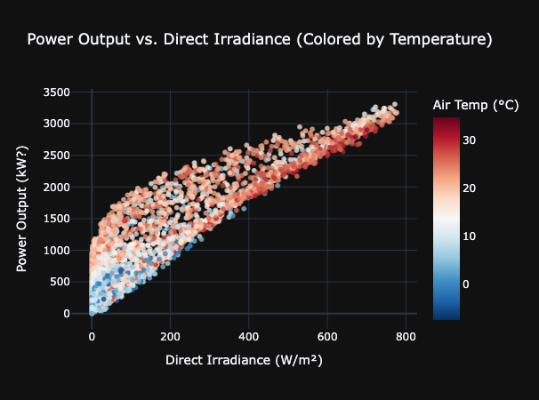

# Solar power output prediction

 
## Table of Contents

1. Project Goal
2. Problem Statement
3. Project Structure 
4. Data Source (PVGIS API)
5. Feature Engineering (Apache Spark)
6. Modeling Approach
7. Evaluation Metrics & Results
8. Why Spark + Scikit-learn + XGBoost?
9. How to Run
10. Limitations & next steps

## Project Goal

To develop a machine learning model capable of predicting the solar power output for a specific geographical location using historical weather data and time-based features.

## Problem Statement

Accurate short-term solar power output forecasting is crucial for efficient solar power  operations, grid management, energy trading, and optimizing photovoltaic (PV) system performance. 
This project aims to predict solar power output (in W) one hour ahead (t+1) based on weather conditions and temporal information available up to the current hour (t).

## Project Structure

*see project_structure.txt as it would evolve over time*

## Data Source (PVGIS API)

The historical weather and power output data was obtained from the **Photovoltaic Geographical Information System (PVGIS)** provided by the European Commission Joint Research Centre.

*   **API Tool Used:** PVGIS Hourly Radiation 
*   **Endpoint Base:** `https://re.jrc.ec.europa.eu/api/`
*   **Specific Tool Endpoint:** `seriescalc` (for hourly time series data)
*   **Location:**
    *   Latitude: `[Your Latitude, e.g., 45.8]`
    *   Longitude: `[Your Longitude, e.g., 6.1]`
*   **Key Parameters Used:**
    *   `lat`: Latitude
    *   `lon`: Longitude
    *   `startyear`: `[Your Start Year, e.g., 2020]`
    *   `endyear`: `[Your End Year, e.g., 2023]`
    *   `outputformat`: `csv` (or `json`)
    *   `variables`: 
		- time [UTC]
		- P [W] - PV power output (if requested)
		- G(i) [W/m2] - Global in-plane irradiance (if radiation components are not requested)
		- Gb(i) [W/m2] - Direct in-plane irradiance (if radiation components are requested)
		- Gd(i) [W/m2] - Diffuse in-plane irradiance (if radiation components are requested)
		- Gr(i) [W/m2] - Reflected in-plane irradiance (if radiation components are requested)
		- H_sun [°] - Sun height (elevation)
		- T2m [°C] - Air temperature
		- WS10m [m/s] - Wind speed at 10m

## Feature Engineering (Apache Spark)

Apache Spark was utilized for efficient preprocessing and feature engineering on the potentially large raw time-series dataset. Key features created include:

1.  **Target Variable:** The target `power_output_t_+_1` was created by shifting the `power_output` column forward by one hour using Spark's `Window` functions (`lead`).
Rows where the target could not be calculated (i.e., the last row of the dataset) were dropped.

2.  **Lag Features:** Past values (lags) of key variables (power output, direct & diffuse irradiance, sun height, air temperature, wind speed) were created to capture temporal dependencies and recent trends. This was achieved using Spark's `Window` functions partitioned appropriately (e.g., by location if multiple sites) and ordered by time, combined with the `lag` function.

3.  **Time Features:** Cyclical and sequential time features were extracted from the timestamp to help models understand daily and yearly patterns. Spark SQL functions like `hour()`, `dayofweek()`, `dayofyear()`, `month()` were used.
 **Cyclical Encoding:** Sine and Cosine transformations were applied to features like `hour` and `dayofyear` to represent their cyclical nature (e.g., hour 23 is close to hour 0).
 

## Modeling Approach

A hybrid approach leveraging both Spark and Scikit-learn was adopted:

1.  **Data Preparation in Spark:** All initial data loading, cleaning, and feature engineering (lags, time features, target creation) were performed using PySpark.

2.  **Data Transfer:** Once the feature set was finalized, the resulting Spark DataFrame, containing only the selected features and the target variable, was collected into the driver node's memory as a Pandas DataFrame using `.toPandas()`. 
   This step is viable when the final feature set is manageable in size for a single machine.

3.  **Model Training in Scikit-learn:** The Pandas DataFrame was then used for model training and evaluation using the Scikit-learn library.
    *   **Train/Test Split:** A chronological split was performed on the Pandas DataFrame, using the earlier portion for training and the later portion for testing to simulate a real-world forecasting scenario.
    *   **Baseline Model:** A `LinearRegression` model was trained as a simple baseline to establish benchmark performance.
    *   **Improved Model:** A more complex, non-linear model, specifically  a gradient boosting algorithms (`XGBoost`)

## Evaluation metrics & results

Model performance was evaluated on the unseen test set using standard regression metrics:

*   **Root Mean Squared Error (RMSE):** Measures the standard deviation of the prediction errors (residuals). Units are the same as the target (W). Lower is better.
*   **Mean Absolute Error (MAE):** Measures the average magnitude of the errors. Less sensitive to large outliers than RMSE. Units are W. Lower is better.
*   **R-squared (R²):** Represents the proportion of the variance in the dependent variable (power_output) that is predictable from the independent variables (features). Ranges from 0 to 1 (or negative for poor models). Higher is better.

## Why Spark + Scikit-learn + XGBoost?

This project deliberately combines Spark, Scikit-learn, and XGBoost to leverage the strengths of each component:

**Apache Spark:**
- **Scalability:** Ideal for handling potentially very large raw historical weather datasets that might not fit into a single machine's memory.
- **Efficient Feature Engineering:** Spark's distributed nature and optimized functions (especially Window functions) are highly efficient for creating complex time-series features like lags and rolling windows across large datasets.
- **Initial Data Cleaning:** Distributed cleaning operations (handling nulls, filtering) are faster on large data volumes.

**Scikit-learn:**
- **Rich ML Ecosystem:** Provides the foundational tools for preprocessing (like StandardScaler), model definition (LinearRegression), and evaluation (metrics).
- **Rapid Prototyping & Baseline:** Easy to quickly implement and evaluate simpler baseline models.

**XGBoost (eXtreme Gradient Boosting):**
- **High Performance:** Chosen as the advanced model because it's a highly optimised gradient boosting algorithm known for achieving state-of-the-art results on structured/tabular data, like our time series data set.
- **Captures Non-Linearity & Interactions:** power output prediction involves complex, non-linear relationships (e.g., direct irradiance with air temperature, time-of-day cycles) and feature interactions (e.g., temperature's effect varying by season or hour). XGBoost's tree-based nature inherently captures these complex patterns far better than linear models.
- **Regularization:** Includes built-in L1 and L2 regularization, which helps prevent overfitting on the training data and improves the model's ability to generalize to unseen test data.
- **Efficiency:** Despite its complexity, XGBoost is designed for computational efficiency and speed, making it practical for training even on moderately large datasets within the Scikit-learn environment.

## How to Run

1.  **Configure:** Update `config.yaml` with the correct paths for your environment and desired PVGIS parameters (location, years).
2.  **Data Acquisition:** Run the data fetching part (e.g., relevant cells in `notebooks/01-ted-get-data.ipynb` or a dedicated script) to download the raw data using the PVGIS API.
3.  **Preprocessing & Feature Engineering:** Execute the Spark-based steps (e.g., `notebooks/02-ted-data-prep-spark.ipynb`, `notebooks/03-ted-features_eng.ipynb`) to clean the data and generate features, saving intermediate results as configured.
4.  **Modeling:** Run the Scikit-learn & XGBoost modeling steps (e.g., `notebooks/04-model-creation.ipynb`) to load the processed features, train the baseline and improved models, evaluate them, and save the models and results.

## Limitations & next steps

*  **Data freshness**: the available data is until 31-12-2023. update the model with more recent data points (2024-2025)
*   **Feature Scope:** Did not incorporate external data like satellite cloud imagery, weather forecasts, or aerosol index, which could improve accuracy.
*   **Single Location:** Model trained for one specific location; performance may vary for other locations. Retraining or multi-location modeling would be needed.
*   **PVGIS Data:** TMY data represents typical conditions; using actual historical data for specific recent years might be better for predicting near-term future.

**Next steps**
- Add location data based on zone instead of a point 
- Incorporate numerical weather prediction  forecast data as features.
- Explore feature engineering based on solar angles (azimuth, elevation).
- Deploy the model as a simple API endpoint 
- Build a Streamlit App  to use the model
